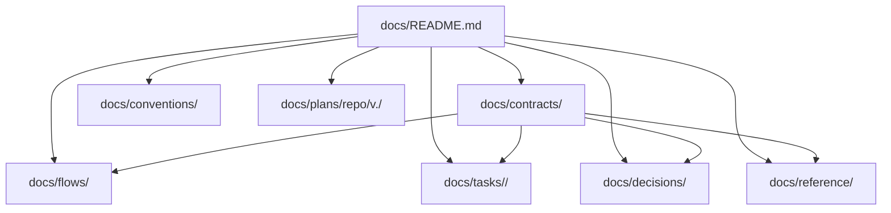

# Docs Structure

- `docs/README.md`: Repository documentation map for humans and agents.
- `docs/contracts/`: Canonical executable contracts grouped by topic.
- `docs/flows/`: Checked-in root flow definitions grouped by topic.
- `docs/tasks/<contract-slug>/`: Decomposed execution units linked to one
  contract.
- `docs/tasks/untracked/`: Exceptional holding area for tasks that still need a
  governing contract relation.
- `docs/decisions/`: Durable decisions that constrain contracts and tasks.
- `docs/conventions/`: Workflow, metadata, naming, and repo conventions.
- `docs/reference/`: Stable domain and product knowledge that contracts can
  depend on.
- `docs/plans/repo/<version>/`: Repo evolution plans for changing Pravaha
  itself. Use `v<major>.<minor>` versions such as `v0.1` and `v1.0`.

- Treat semantic ids and graph relations as the workflow source of truth.
- Use directory placement for validation and readability, not as the meaning of
  a work item.
- Keep review gates inside contract documents.
- Prefer front matter metadata and headings over visible `Label: value` prose in
  workflow docs.
- Keep the `docs/` root thin. Put workflow documents in their canonical class
  directories instead of root-level special cases.

