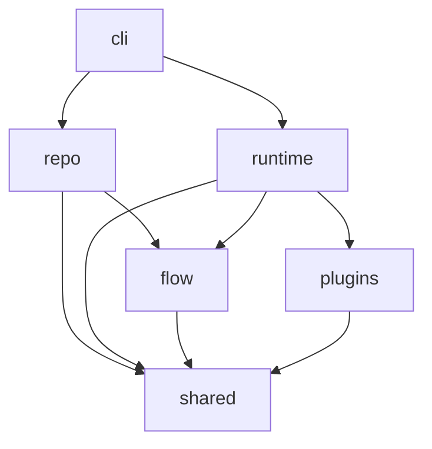

# Code Structure Alignment Plan

## Goal

- Reduce the learning cost of the Pravaha codebase by making the source tree
  reflect the repository's documented runtime architecture and workflow slices.

## Scope

- Replace the current flat `lib/` layout with subsystem directories that expose
  clearer ownership boundaries.
- Split the largest coordination modules into thin orchestration entrypoints and
  focused collaborators.
- Align code ownership with the documented control plane, policy plane, and
  runtime data plane.
- Add one checked-in code map that links major contracts and decisions to the
  modules that implement them.
- Preserve the current public package and CLI surface while the internal
  structure migrates.

## Non-Goals

- No runtime behavior change beyond the minimum import and entrypoint shims
  needed to preserve compatibility during the restructuring.
- No change to the checked-in workflow document layout under `docs/`.
- No plugin API redesign in this slice.

## Target Structure

```text
lib/
  cli/
    main.js
    commands/
  flow/
    load/
    query/
    runtime/
    validate/
  plugins/
    core/
    contract/
    load/
  repo/
    validate/
    semantics/
  runtime/
    attempts/
    dispatch/
    records/
    workers/
    workspaces/
  shared/
    diagnostics/
    fs/
    git/
    types/
```



## Boundaries

- `cli/` owns argument parsing, help rendering, and command-to-service wiring.
- `repo/` owns repository-wide validation, semantic model loading, and config
  entrypoints.
- `flow/` owns parsing, query validation, interpretation, and executable flow
  loading.
- `runtime/dispatch/` owns leader election, worker registration, assignment
  planning, and wake-up handling.
- `runtime/attempts/` owns state-machine execution, resume behavior, and plugin
  visit orchestration.
- `runtime/records/` owns runtime-record persistence and record projections.
- `runtime/workers/` owns Codex worker supervision and worker-facing I/O.
- `plugins/` owns plugin contracts, core plugins, and plugin resolution.
- `shared/` owns low-level helpers that are safe to depend on across subsystems.

## Acceptance

- New contributors can find the code for one contract or decision by reading one
  code map document and following one subsystem path.
- The current high-churn orchestration files move behind subsystem directories
  and become thin entrypoints rather than multi-purpose implementation buckets.
- `local-dispatch-runtime`, `runtime-attempt`, `reconcile-flow`,
  `validate-flow-document`, and `pravaha-cli` no longer carry the full
  implementation for their subsystems in one file.
- New internal imports follow subsystem direction instead of cross-cutting the
  flat `lib/` namespace.
- Public package exports and CLI commands continue to resolve during the
  migration.

## Sequencing

- Phase 1: Ownership map and shims
  - Add a runtime code map under `docs/reference/runtime/` that links contracts
    and decisions to owning modules.
  - Create subsystem directories with compatibility re-export shims from the
    current root filenames.
  - Move shared low-level helpers first because they have the smallest behavior
    surface.
- Phase 2: Runtime dispatch split
  - Extract endpoint protocol adaptation, dispatcher election, follower session
    handling, assignment planning, and operator logging from
    `local-dispatch-runtime`.
  - Keep one top-level runtime facade that wires those collaborators together.
- Phase 3: Attempt engine split
  - Extract attempt context setup, resume loading, job execution, branch
    selection, plugin invocation, and final record writing from
    `runtime-attempt`.
  - Keep one narrow state-machine executor module as the public runtime entry.
- Phase 4: Flow and validation split
  - Separate flow parsing, executable interpretation, plugin argument
    validation, and query validation into dedicated `flow/` modules.
  - Reduce repo validation to orchestration over `repo/` and `flow/` services.
- Phase 5: CLI cleanup
  - Move command parsing and rendering into `cli/commands/`.
  - Keep the package entrypoint stable while the internal command handlers move.
- Phase 6: Guardrails
  - Add lightweight structural tests that assert the intended public entrypoints
    and subsystem import direction.
  - Tighten lint rules only after the new module seams are stable.

## Migration Notes

- Prefer file moves plus compatibility shims over big-bang renames so tests stay
  green through the transition.
- Move fixtures and test helpers alongside the subsystem they primarily support.
- Use the active runtime contracts as the decomposition guide instead of naming
  modules after incidental helper functions.
- Stop adding new feature logic to the flat `lib/` root once the first subsystem
  directory lands.
