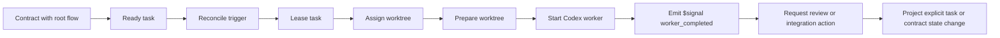

# End-To-End Walkthrough

This document captures the intended happy-path execution model from contract to
integration.

## Scenario

- A contract references one root flow.
- The contract has one or more tasks.
- A task becomes semantically `ready`.
- Pravaha is triggered to reconcile.

## Walkthrough



## Example Flow

```yaml
kind: flow
id: walkthrough
status: active
scope: contract

jobs:
  implement_ready_tasks:
    select: $class == task and tracked_in == @document and status == ready
    worktree:
      mode: ephemeral
    steps:
      - run: npm ci
      - uses: core/codex-exec
      - await:
          $class == $signal and kind == worker_completed and subject == task
      - if:
          $class == $signal and kind == worker_completed and subject == task and
          outcome == success
        uses: core/request-review
        transition:
          target: task
          status: review
```

## State Split

```json
{
  "checked_in": [
    "contract status",
    "task status",
    "review intent",
    "merge intent"
  ],
  "machine_local": [
    "lease ownership",
    "worktree state",
    "worker state",
    "runtime signals"
  ]
}
```

## Notes

- The flow may continue at task scope or contract scope depending on later job
  conditions.
- Worktree assignment and preparation happen before the declared steps rather
  than through a bundled `uses` step.
- The runtime may be idle between triggers even though the shared workflow state
  stays durable in git.
