# End-To-End Walkthrough

This document captures the intended happy-path execution model from contract to
integration for the state-machine flow surface.

## Scenario

- A contract references one root flow.
- The contract has one or more tasks.
- A task becomes semantically `ready`.
- Pravaha is triggered to reconcile.

## Walkthrough

```mermaid
graph LR
  A["Contract with root flow"] --> B["Ready task"]
  B --> C["Reconcile trigger"]
  C --> D["Create durable job instance"]
  D --> E["Materialize flow workspace"]
  E --> F["Run first declared job"]
  F --> G["Persist result and latest job outputs"]
  G --> H["Evaluate next"]
  H --> I["Advance to one successor job"]
  I --> J["Reach terminal end"]
```



## Example Flow

```yaml
kind: flow
id: walkthrough
status: active
scope: contract

workspace:
  type: git.workspace
  source:
    kind: repo
    id: app
  materialize:
    kind: worktree
    mode: ephemeral
    ref: main

on:
  task:
    where: $class == task and tracked_in == @document and status == ready

jobs:
  implement:
    uses: core/agent
    with:
      provider: codex-sdk
      prompt: Implement the task in ${{ task.path }}.
    next: test

  test:
    uses: core/run
    with:
      command: npm test
      capture: [stdout, stderr]
    next:
      - if: ${{ result.exit_code == 0 }}
        goto: review
      - goto: fix

  fix:
    uses: core/agent
    with:
      provider: codex-sdk
      prompt: |
        The test run failed for ${{ task.path }}.

        stdout:
        ${{ jobs.test.outputs.stdout }}

        stderr:
        ${{ jobs.test.outputs.stderr }}
    limits:
      max-visits: 3
    next: test

  review:
    uses: core/approval
    with:
      title: Review ${{ task.path }}
      message: Approve or reject this task.
      options: [approve, reject]
    next:
      - if: ${{ result.verdict == "approve" }}
        goto: done
      - goto: rejected

  done:
    end: success

  rejected:
    end: rejected
```

## State Split

```json
{
  "checked_in": [
    "contract status",
    "task status",
    "workspace policy",
    "job graph"
  ],
  "machine_local": [
    "instance cursor",
    "latest job outputs",
    "visit counts",
    "worktree materialization state"
  ]
}
```

## Notes

- The first declared job is the entrypoint for each matched task instance.
- The runtime evaluates `next` against the current visit through `result`.
- Prior node data remains available through `jobs.<name>.outputs`.
- Waiting for people or systems is expressed through plugins such as
  `core/approval` rather than engine-level `await`.
