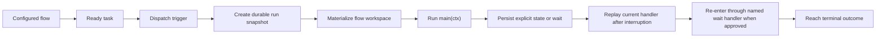

# End-To-End Walkthrough

This document captures the intended execution model from contract to integration
for the JavaScript flow module surface.

## Scenario

- One configured flow glob matches the checked-in flow.
- The contract has one or more tasks.
- A task becomes Patram `ready`.
- Pravaha receives a dispatcher wake-up or worker startup rescan.

## Walkthrough



## Example Flow

```js
import { approve, defineFlow, run, runCodex } from 'pravaha';

export default defineFlow({
  on: {
    patram:
      '$class == task and tracked_in == contract:walkthrough and status == ready',
  },

  workspace: {
    id: 'app',
  },

  async main(ctx) {
    await runCodex(ctx, {
      prompt: `Implement the task in ${ctx.task.path}.`,
      reasoning: 'medium',
    });
    await run(ctx, {
      capture: ['stdout', 'stderr'],
      command: 'npm test',
    });
    await ctx.setState({
      phase: 'awaiting-review',
    });
    await approve(ctx, {
      title: `Review ${ctx.task.path}`,
      message: 'Approve or reject this task.',
      data: {
        approved_at_phase: 'awaiting-review',
      },
    });
  },

  async onApprove(ctx, data) {
    ctx.console.log(`Approved during ${data.approved_at_phase}.`);
  },
});
```

## State Split

```json
{
  "checked_in": [
    "contract status",
    "task status",
    "workspace namespace",
    "flow module metadata and handlers"
  ],
  "machine_local": [
    "current handler name",
    "durable flow state",
    "pending wait payload",
    "resolved workspace directory"
  ]
}
```

## Notes

- `main(ctx)` is the entrypoint for each matched task instance.
- Replay restarts the current handler from the top with the latest durable
  `ctx.state`.
- Waiting for people or systems is expressed through imported built-ins such as
  `approve(ctx, with)`.
- Resume after approval enters a named handler such as `onApprove(ctx, data)`.
