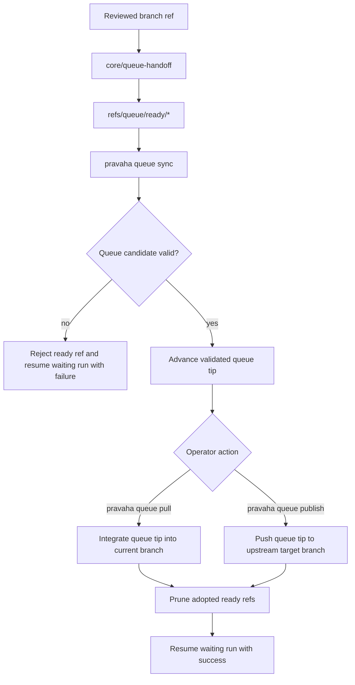

# Git-Owned Merge Queue

## Default Shape

```json
{
  "queue": {
    "dir": ".pravaha/queue.git",
    "upstream_remote": "origin",
    "target_branch": "main",
    "ready_ref_prefix": "refs/queue/ready",
    "candidate_ref": "refs/heads/main",
    "base_ref": "refs/queue/meta/base",
    "validation_flow": null
  }
}
```

## Ref Topology

```text
working repo
  ├─ normal remote setup stays unchanged
  └─ pravaha queue ... operates explicitly against .pravaha/queue.git

bare queue repo (.pravaha/queue.git)
  ├─ refs/heads/main
  │  validated queue tip for the configured target branch
  ├─ refs/queue/ready/<order>-<name>
  │  queued branch refs waiting for explicit adoption or rejection
  ├─ refs/queue/candidate/current
  │  optional current candidate for debugging and validation flow input
  └─ refs/queue/meta/base
     upstream target commit used to build the current candidate
```

## Lifecycle



## Command Intent

- `pravaha queue init`
  - Read queue config or defaults.
  - Create the bare queue repository when missing.
  - Install Node-based hook scripts.
  - Seed queue refs from the configured upstream target branch.
  - Leave local remotes and branch tracking untouched.
- `pravaha queue sync`
  - Fetch the configured upstream target branch into the bare queue repo.
  - Rebuild `refs/queue/candidate/current` from the upstream base plus ordered
    ready refs.
  - Fail fast when a queued branch no longer applies cleanly.
  - Optionally dispatch a configured validation flow against the candidate tip.
  - Advance the validated queue tip on success.
  - Do not publish upstream.
  - Do not remove successful ready refs.
- `pravaha queue pull`
  - Explicitly integrate the validated queue tip into the current branch.
  - Prune only the ready refs whose branch tips became reachable from the
    current branch after the pull.
- `pravaha queue publish`
  - Explicitly publish the validated queue tip to the configured upstream target
    branch.
  - Prune only the ready refs whose branch tips became reachable from the
    published upstream target branch.

## Runtime Note

- Git refs remain the queue source of truth.
- Pravaha runtime state exists only to correlate a queued ready ref with a
  waiting paused run so queue success or failure can resume the original flow.
