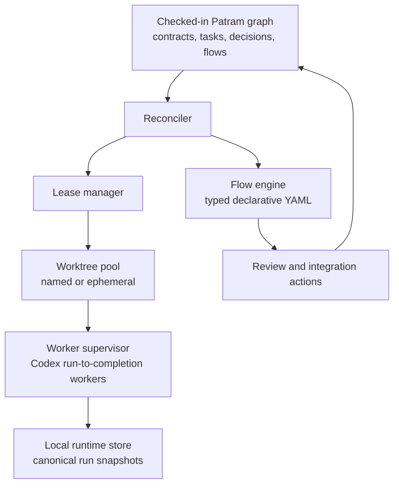
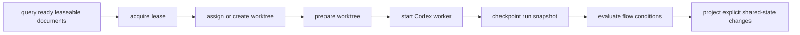

# Pravaha Runtime Architecture

This document captures the supporting architecture model behind the current
Pravaha decisions.

## Planes

- Patram is the control plane for shared, portable workflow state.
- The Pravaha runtime is the data plane for local execution, supervision, and
  transient operational state.
- Flow documents are the policy plane that define how work moves through the
  system.



## Shared And Local State

- Shared workflow intent stays in checked-in Patram documents.
- Machine-local runtime state stays outside git, but remains queryable through
  the mixed runtime graph.

```json
{
  "portable_shared_truth": [
    "contracts",
    "tasks",
    "decisions",
    "flow references",
    "review and merge intent"
  ],
  "machine_local_runtime_truth": [
    "current durable run snapshot",
    "prior job outputs",
    "job visit counts",
    "pending waits",
    "terminal outcomes at the current checkpoint"
  ]
}
```

## Core Execution Loop

Pravaha reconciles durable workflow state with one machine-local durable run
snapshot per live task.



## Key Constraints

- Contracts own exactly one root flow.
- The flow root is bound as `document`.
- A job `select` binds the selected durable document under its Patram class
  name, such as `task` or `ticket`.
- `jobs.<name>.select` only fans out over durable workflow documents.
- Flow branch conditions may query durable workflow documents plus the current
  run snapshot.
- Leasing is tied to the configured semantic `ready` state.
- One leased task or equivalent leaseable document occupies one worktree at a
  time.
- Workers are locally supervised run-to-completion processes.
