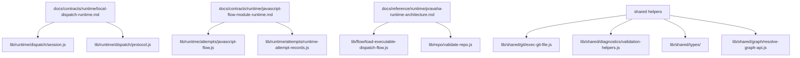

# Runtime Code Map

## Intent

- Link the current checked-in runtime implementation to the contracts and
  decisions that explain it.
- Show the post-migration subsystem layout without flattening ownership back
  into the `lib/` root.

## Current Ownership

```json
{
  "public_entrypoints": {
    "package": "lib/pravaha.js",
    "cli": "bin/pravaha.js",
    "cli_main": "lib/cli/main.js"
  },
  "runtime_dispatch": {
    "contract": "docs/contracts/runtime/local-dispatch-runtime.md",
    "modules": [
      "lib/runtime/dispatch/context.js",
      "lib/runtime/dispatch/graph.js",
      "lib/runtime/dispatch/dispatcher.js",
      "lib/runtime/dispatch/protocol.js",
      "lib/runtime/dispatch/session.js",
      "lib/runtime/records/runtime-records.js",
      "lib/runtime/records/runtime-record-model.js"
    ]
  },
  "attempt_engine": {
    "contract": "docs/contracts/runtime/javascript-flow-module-runtime.md",
    "modules": [
      "lib/runtime/attempts/javascript-flow.js",
      "lib/runtime/attempts/runtime-attempt-records.js",
      "lib/runtime/attempts/runtime-attempt-support.js",
      "lib/flow/built-ins.js",
      "lib/runtime/workspaces/runtime-files.js"
    ]
  },
  "flow_policy": {
    "modules": [
      "lib/flow/load-executable-dispatch-flow.js",
      "lib/flow/load-flow-definition.js",
      "lib/flow/query.js",
      "lib/flow/validate-flow-document.js"
    ]
  },
  "repo_validation": {
    "modules": [
      "lib/repo/validate-repo.js",
      "lib/repo/semantics/create-patram-model.js"
    ]
  },
  "plugin_runtime": {
    "modules": ["lib/plugins/plugin-contract.js", "lib/plugins/core/"]
  },
  "shared_low_level": {
    "modules": [
      "lib/shared/graph/resolve-graph-api.js",
      "lib/shared/git/exec-git-file.js",
      "lib/shared/diagnostics/validation-helpers.js",
      "lib/shared/types/patram-types.ts",
      "lib/shared/types/validation.types.ts"
    ]
  }
}
```

## Target Ownership

```text
lib/
  cli/
  flow/
  plugins/
  repo/
  runtime/
    attempts/
    dispatch/
    records/
    workers/
    workspaces/
  shared/
    diagnostics/
    git/
    types/
```

## Mapping



## Notes

- `lib/pravaha.js` remains the package facade while internal modules move behind
  subsystem directories.
- Callable plugins now execute through direct module imports. The older
  namespace-based step-plugin loader path is no longer part of current runtime
  ownership.
- The migration removed the temporary root compatibility shims. New internal
  imports should resolve directly to subsystem modules.
- The active runtime contracts define the primary seams for future moves. Avoid
  creating new cross-cutting helpers in the flat `lib/` root.
