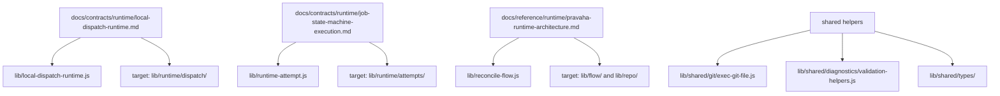

# Runtime Code Map

## Intent

- Link the current checked-in runtime implementation to the contracts and
  decisions that explain it.
- Make the ongoing subsystem migration visible without changing runtime
  behavior.

## Current Ownership

```json
{
  "public_entrypoints": {
    "package": "lib/pravaha.js",
    "cli": "bin/pravaha.js",
    "cli_main": "lib/pravaha-cli.js"
  },
  "runtime_dispatch": {
    "contract": "docs/contracts/runtime/local-dispatch-runtime.md",
    "modules": [
      "lib/local-dispatch-runtime.js",
      "lib/local-dispatch-protocol.js",
      "lib/runtime-records.js",
      "lib/runtime-record-model.js"
    ]
  },
  "attempt_engine": {
    "contract": "docs/contracts/runtime/job-state-machine-execution.md",
    "modules": [
      "lib/runtime-attempt.js",
      "lib/runtime-attempt-records.js",
      "lib/runtime-attempt-support.js",
      "lib/runtime-worker.js",
      "lib/state-machine-runtime.js"
    ]
  },
  "flow_policy": {
    "modules": [
      "lib/reconcile-flow.js",
      "lib/load-flow-definition.js",
      "lib/flow-query.js",
      "lib/validate-flow-document.js"
    ]
  },
  "repo_validation": {
    "modules": [
      "lib/validate-repo.js",
      "lib/create-semantic-model.js",
      "lib/reconcile-semantics.js"
    ]
  },
  "plugin_runtime": {
    "modules": [
      "lib/plugin-contract.js",
      "lib/plugin-loader.js",
      "lib/core-step-plugins.js"
    ]
  },
  "shared_low_level": {
    "modules": [
      "lib/git-process.js",
      "lib/validation-helpers.js",
      "lib/patram-types.ts",
      "lib/validation.types.ts"
    ]
  }
}
```

## Target Ownership

```text
lib/
  cli/
  flow/
  plugins/
  repo/
  runtime/
    attempts/
    dispatch/
    records/
    workers/
    workspaces/
  shared/
    diagnostics/
    git/
    types/
```

## Mapping



## Notes

- `lib/pravaha.js` remains the package facade while internal modules move behind
  subsystem directories.
- Root-level files may temporarily remain as compatibility shims during the
  migration.
- The active runtime contracts define the primary seams for future moves. Avoid
  creating new cross-cutting helpers in the flat `lib/` root.
