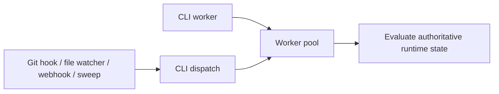

# Trigger Catalog

This document captures the trigger surface for the trigger-driven runtime.

## Trigger Model

- Pravaha does not need to run as a mandatory daemon in `v0.1`.
- Durable flow execution is activated by explicit triggers.
- Dispatch workers rescan authoritative runtime state on startup or takeover.

## Trigger Types

```json
{
  "triggers": [
    "CLI worker command",
    "CLI dispatch command",
    "git hooks",
    "file watchers",
    "webhooks or network requests",
    "optional periodic sweep"
  ]
}
```

## Roles

| Trigger        | Purpose                                | Typical use                                                      |
| -------------- | -------------------------------------- | ---------------------------------------------------------------- |
| CLI worker     | Long-running local worker-pool runtime | Startup or takeover rescan, live assignment supervision          |
| CLI dispatch   | Best-effort dispatcher wake-up         | Nudge the active dispatcher after durable state changes          |
| Git hooks      | React to local repository actions      | Reconcile after commit, branch movement, or review prep          |
| File watchers  | React to local file changes            | Notice document or config changes that affect readiness          |
| Webhooks       | React to external systems              | Review completion, merge queue state, remote integration signals |
| Periodic sweep | Catch missed events                    | Poll remote state when no direct callback exists                 |

## Trigger To Runtime Relation


