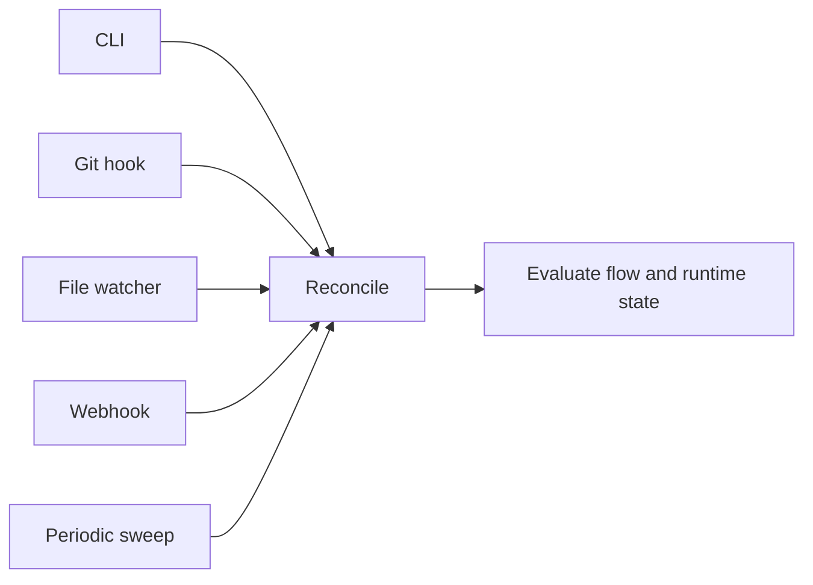

# Trigger Catalog

This document captures the trigger surface for the trigger-driven runtime.

## Trigger Model

- Pravaha does not need to run as a mandatory daemon in `v0.1`.
- Reconciliation is activated by explicit triggers.
- Manual resume after restart is expected.

## Trigger Types

```json
{
  "triggers": [
    "CLI reconcile command",
    "git hooks",
    "file watchers",
    "webhooks or network requests",
    "optional periodic sweep"
  ]
}
```

## Roles

| Trigger        | Purpose                                 | Typical use                                                      |
| -------------- | --------------------------------------- | ---------------------------------------------------------------- |
| CLI reconcile  | Explicit operator-driven reconciliation | Resume after restart, debug a flow, run local progress checks    |
| Git hooks      | React to local repository actions       | Reconcile after commit, branch movement, or review prep          |
| File watchers  | React to local file changes             | Notice document or config changes that affect readiness          |
| Webhooks       | React to external systems               | Review completion, merge queue state, remote integration signals |
| Periodic sweep | Catch missed events                     | Poll remote state when no direct callback exists                 |

## Trigger To Runtime Relation


