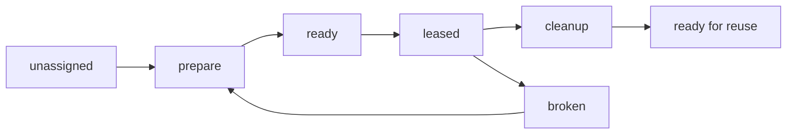

# Worktree Lifecycle

This document captures the working model for reusable Pravaha worktrees.

## Core Rules

- One leaseable document occupies one worktree at a time.
- Checked-in flow policy declares workspace materialization at flow scope.
- Worktrees may be ephemeral for one run or pooled for reuse across runs.
- Reuse requires explicit prepare and cleanup work.

## Lifecycle



## Expected Operations

```json
{
  "prepare": [
    "checkout or reset target branch",
    "clean transient build outputs",
    "install or verify dependencies",
    "confirm worktree health"
  ],
  "cleanup": [
    "remove transient outputs such as dist",
    "clear stale task-local artifacts",
    "leave the worktree in a reusable state"
  ]
}
```

## Reuse Scenarios

- Ephemeral worktree: Created for one run and discarded afterward.
- Pooled worktree: Assigned dynamically from a bounded local pool.
- Checkout shapes for `remote` and `bare` sources are separate workspace
  materializations and are not part of the repo-backed worktree slice.

## Checked-In Policy

```yaml
workspace:
  type: git.workspace
  source:
    kind: repo
    id: app
  materialize:
    kind: worktree
    mode: ephemeral
    ref: main
```

```yaml
workspace:
  type: git.workspace
  source:
    kind: repo
    ids:
      - app
      - app-1
      - app-2
  materialize:
    kind: worktree
    mode: pooled
    ref: main
```

- Declare workspace policy once at flow scope.
- Use `source.id` for one reusable slot or `source.ids` for multiple pooled
  slots in declaration order.
- Repo-backed checked-in worktrees currently allow only `ephemeral` and `pooled`
  modes.
- Resume reuses the recorded resolved assignment instead of selecting again.

## Health Expectations

- The assigned branch and remote target are known.
- The worktree can be reset into a clean execution baseline.
- Dependency installation is either already satisfied or can be made explicit as
  a prepare step.
- A broken worktree is not reused until it passes prepare again.
