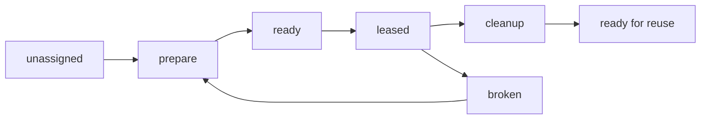

# Worktree Lifecycle

This document captures the working model for reusable Pravaha worktrees.

## Core Rules

- One leaseable document occupies one worktree at a time.
- Worktrees may be named, long-lived, and reused across runs.
- Reuse requires explicit prepare and cleanup work.

## Lifecycle



## Expected Operations

```json
{
  "prepare": [
    "checkout or reset target branch",
    "clean transient build outputs",
    "install or verify dependencies",
    "confirm worktree health"
  ],
  "cleanup": [
    "remove transient outputs such as dist",
    "clear stale task-local artifacts",
    "leave the worktree in a reusable state"
  ]
}
```

## Reuse Scenarios

- Ephemeral worktree: Created for one run and discarded afterward.
- Named worktree: Reused as a slot such as `abbot` or `castello`.
- Pooled worktree: Assigned dynamically from a bounded local pool.

## Health Expectations

- The assigned branch and remote target are known.
- The worktree can be reset into a clean execution baseline.
- Dependency installation is either already satisfied or can be made explicit as
  a prepare step.
- A broken worktree is not reused until it passes prepare again.
