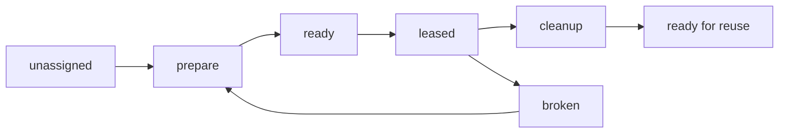

# Worktree Lifecycle

This document captures the working model for reusable Pravaha worktrees.

## Core Rules

- One leaseable document occupies one worktree at a time.
- Checked-in flows declare only `workspace`.
- Global `workspaces.<id>` owns workspace lifecycle, placement, and checkout.
- Worktrees may be pooled for reuse across runs or ephemeral per flow instance.
- Reuse requires explicit prepare and cleanup work.

## Lifecycle



## Expected Operations

```json
{
  "prepare": [
    "checkout or reset target branch",
    "clean transient build outputs",
    "install or verify dependencies",
    "confirm worktree health"
  ],
  "cleanup": [
    "remove transient outputs such as dist",
    "clear stale task-local artifacts",
    "leave the worktree in a reusable state"
  ]
}
```

## Reuse Scenarios

- Pooled workspace: Assigned from one configured fixed path set and left on disk
  after cleanup.
- Ephemeral workspace: Derived under one configured `base_path` from the
  `flow_instance_id` and deleted after cleanup.
- Resume always reuses the recorded concrete directory instead of selecting a
  fresh one.

## Checked-In Flow

```js
export default defineFlow({
  workspace: 'app',
});
```

## Global Workspace Policy

```js
import { defineConfig } from 'pravaha';

export default defineConfig({
  workspaces: {
    app: {
      mode: 'pooled',
      paths: ['.pravaha/worktrees/abbott', '.pravaha/worktrees/castello'],
      ref: 'main',
      source: {
        kind: 'repo',
      },
    },
    validation: {
      mode: 'ephemeral',
      base_path: '.pravaha/worktrees/validation',
      ref: 'main',
      source: {
        kind: 'repo',
      },
    },
  },
});
```

- Declare workspace identity in the flow and policy in `pravaha.config.js`.
- Use `workspace` to select one shared namespace from `pravaha.config.js`.
- Repo-backed global workspaces currently allow only `ephemeral` and `pooled`
  modes.
- Resume reuses the recorded resolved assignment instead of selecting again.

## Health Expectations

- The assigned branch and remote target are known.
- The worktree can be reset into a clean execution baseline.
- Dependency installation is either already satisfied or can be made explicit as
  a prepare step.
- A broken worktree is not reused until it passes prepare again.
