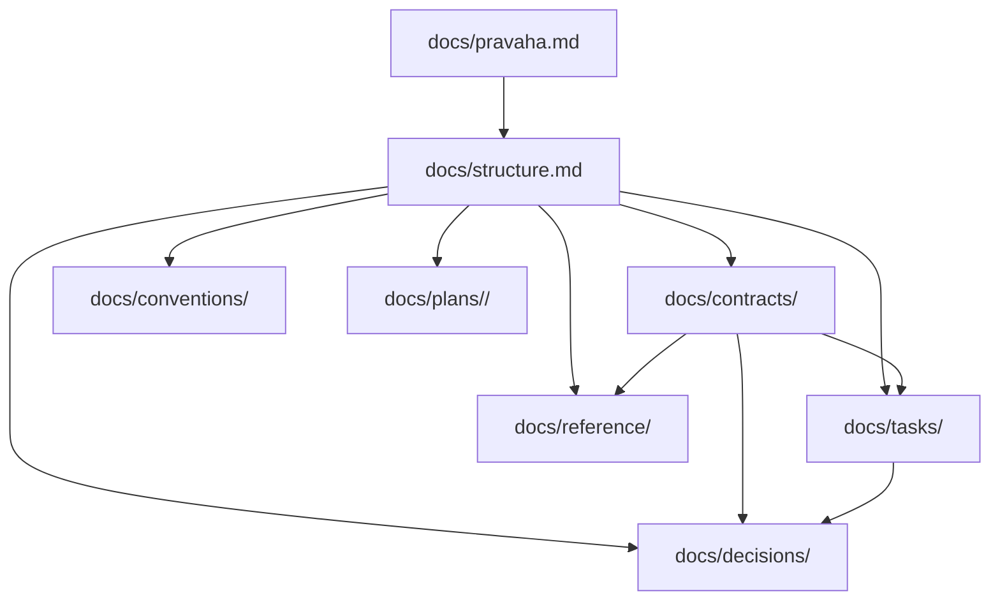

# Docs Structure

- `docs/pravaha.md`: North-star definition of Pravaha.
- `docs/structure.md`: Repository documentation map for humans and agents.
- `docs/contracts/`: Canonical executable contracts.
- `docs/tasks/`: Decomposed execution units linked to contracts.
- `docs/decisions/`: Durable decisions that constrain contracts and tasks.
- `docs/conventions/`: Workflow, metadata, naming, and repo conventions.
- `docs/reference/`: Stable domain and product knowledge that contracts can
  depend on.
- `docs/plans/<version>/`: Repo evolution plans for changing Pravaha itself.

- Treat semantic ids and graph relations as the workflow source of truth.
- Use directory placement for validation and readability, not as the meaning of
  a work item.
- Keep review gates inside contract documents.
- Prefer front matter metadata and headings over visible `Label: value` prose in
  workflow docs.

